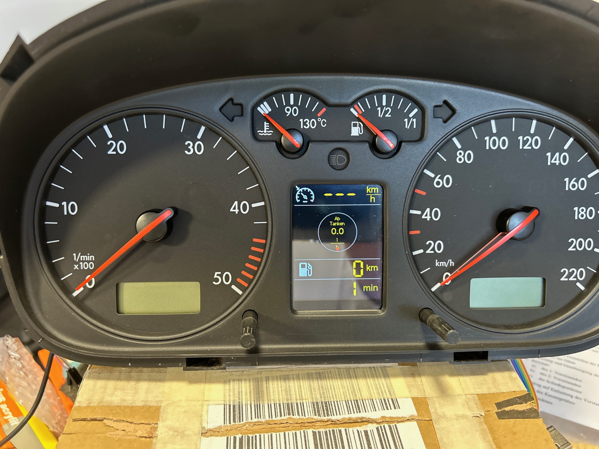

T4-MFA is a projekt to customize the Dash Board from an 
Volkswagen T4 Van with a color MFA (Multi Function Diaplay)

It is based on a ESP32S-Dev Kit C V4 with 512 kB SRAM and 4 MB Flash
The used display is an 3,5 Inch RPI Display with 480x320 Pixel
The connections from the display need to be modified
The CAN connections are done with a WCMCU-230 Modul (R2 has to be removed)
Power Control is solved with a 12V USB Car Adapter (the mainboard from the adapter has been used)
The connections are done to a self desgned brake out board
Some soldering on the Dash Board Instrument has to be done

As the BrakeOut Board had serios errors, I deleted the design files, until they have been corrected!

The fixture of the display has been solved with a 3d printed part.

Please take care to use ARDUINO IDE 2.XX to programm the ESP
You will need to use following libraries

- ESP32 library 2.0.17 
  Do not use newer one as the newer ones are not supported by the TFT_eSPI library
- TFT_eSPI 2.5.43
- ESP32-TWAI-CAN 1.0.1

Feel free to submit improvements

